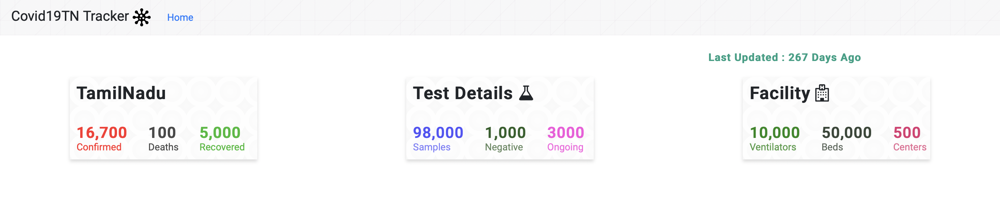
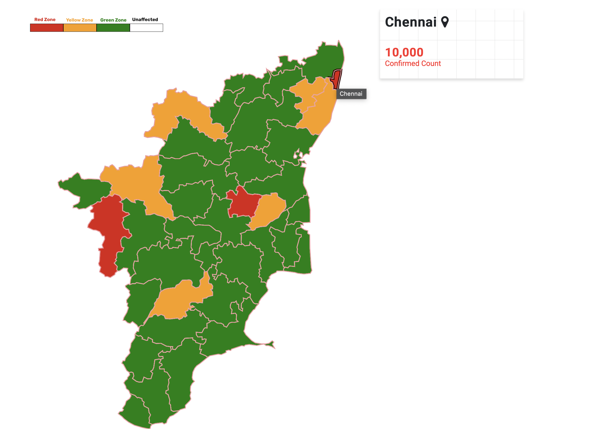
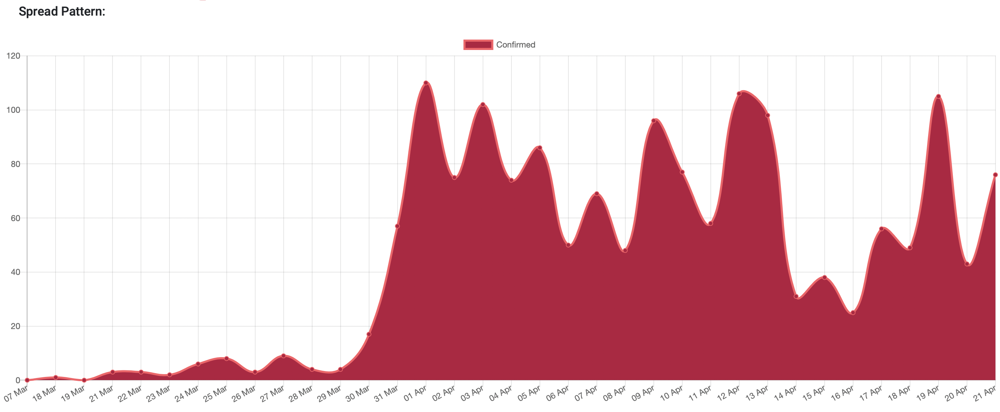
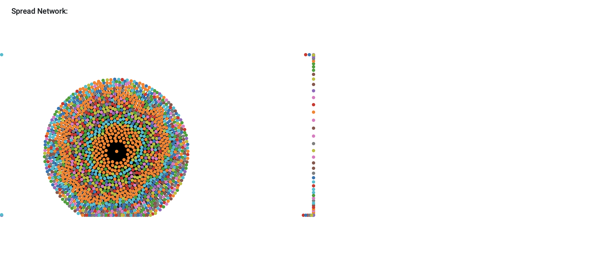

# Covid_Tracker_Dockerized

> Covid Tracker developed using MEAN stack! and Dockerized for quick deployment


## Setup
Make sure you have docker and docker-compose installed.

Docker-compose should be version 1.6 or higher.

### Clone the repo
```bash
$ git clone https://github.com/bernoraj/Covid_Tracker_Dockerized.git
```
 ### Run docker
 ```bash
 $ docker-compose up -d
 ```

 App should be running in `localhost:8181`
 
 
 ## Screenshots
 
 ### header
 
 

 ### svg mapped dataview
 
  
  
 ### spread pattern
 
 
 
  ### d3 model
 
 
